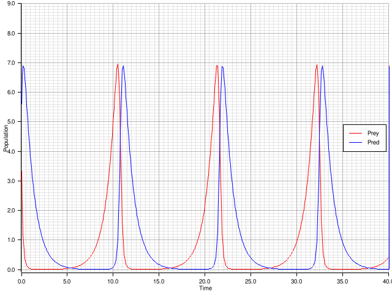
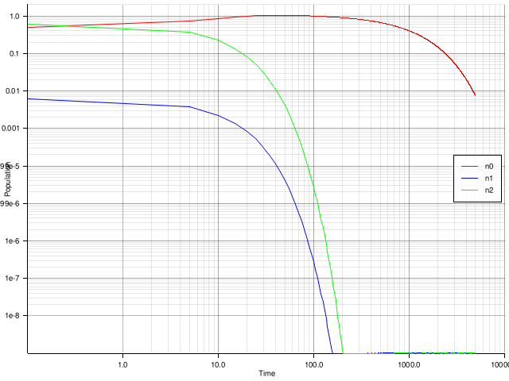

# ORMATEX

**O**ak **R**idge **MAT**rix **EX**ponential tools.

ORMATEX contains methods to compute the matrix exponential:  $`\mathrm{exp}(A t)`$, and the action of the matrix exponential on a vector: $`\mathrm{exp}(A t)v_0`$, where $`A`$ is a matrix.  Additionally, this package contains related methods for the $`\varphi`$-functions.  Krylov methods to evaluate the matrix exponential-vector and $`\varphi`$-vector products are provided for cases where $`A`$ is large and sparse.
Utilizing these methods, ORMATEX implements performant exponential integrators for large systems of coupled ODEs.

ORMATEX is a mixed Rust and Python package that provides an extensible foundation to construct advanced exponential integrators.

The current set of implemented and planned time integration methods in each language:

### Rust

Exponential integrators:

- [x] EPI2 = EXPRB2 = EPIRK2
- [x] EPI3
- [ ] EPIRK4
- [X] EXPRB3
- [ ] EXPRB4  (exponential rosenbrock order 4)

Classic integrators:

- [x] RK1,RK2,RK3,RK4
- [x] Backward Euler
- [x] BDF2
- [x] Crank-Nicolson
- [ ] DIRK
- [ ] SDIRK

### Python

Exponential integrators:

Jacobian based:

- [x] EPI2 = EXPRB2 = EPIRK2
- [x] EPI3
- [ ] EPI4
- [ ] EPIRK4
- [x] EXPRB3
- [ ] EXPRB4

Splitting linear operator based:

- [x] EXP1
- [x] EXP2
- [x] EXP3
- [ ] EXP4

Classic integrators:

- [x] all explicit and implicit integrators supported by diffrax
      (through interface with diffrax)

# Python Setup

### Depends

- jax
- numpy
- scipy
- pytest
- python3.8+
- equinox
- matplotlib
- scikit-fem
- diffrax

### Python Only Install

For a local development install, run:

    pip install -e .

After running the above, the python unit tests can be executed.
From the project base directory (the directory this readme is located in), run:

    pytest

### Use

Examples are provided in the `ormatex_py/progression` directory.

#### Quick Start

Imports

    import jax
    from jax import numpy as jnp
    from ormatex_py.ode_sys import OdeSys, CustomJacLinOp
    from ormatex_py import integrate_wrapper

Define the system

    class LotkaVolterraAD(OdeSys):
        alpha: float
        beta: float
        delta: float
        gamma: float

        def __init__(self, a=1.0, b=1.0, d=1.0, g=1.0, **kwargs):
            super().__init__()
            self.alpha = a
            self.beta = b
            self.delta = d
            self.gamma = g

        @jax.jit
        def _frhs(self, t, x, **kwargs):
            prey_t = self.alpha * x[0] - self.beta * x[0] * x[1]
            pred_t = self.delta * x[0] * x[1] - self.gamma * x[1]
            return jnp.array([prey_t, pred_t])

Initialize the system and integrate

    method = 'epi3'
    sys = LotkaVolterraAD()
    y0 = jnp.array([0.1, 0.2])
    t0 = 0.0
    dt = 0.2
    nsteps = 100
    res = integrate_wrapper.integrate(sys, y0, t0, dt, nsteps, method, max_krylov_dim=2, iom=2)
    t_res, y_res = res.t, res.y

Optionally, an explicit Jacobian can be supplied.  If not supplied, as above, automatic differentiation will be used.

    class LotkaVolterra(OdeSys):
        alpha: float
        beta: float
        delta: float
        gamma: float

        def __init__(self, a=1.0, b=1.0, d=1.0, g=1.0, **kwargs):
            super().__init__()
            self.alpha = a
            self.beta = b
            self.delta = d
            self.gamma = g

        @jax.jit
        def _frhs(self, t, x, **kwargs):
            prey_t = self.alpha * x[0] - self.beta * x[0] * x[1]
            pred_t = self.delta * x[0] * x[1] - self.gamma * x[1]
            return jnp.array([prey_t, pred_t])

        @jax.jit
        def _fjac(self, t, x, **kwargs):
            jac = jnp.array([
                [self.alpha - self.beta * x[1], - self.beta*x[0]],
                [self.delta*x[1], self.delta*x[0] - self.gamma]
                ])
            return CustomJacLinOp(t, x, self.frhs, jac)

#### Integrator Quick Reference

The following integrators are available through the common high level `integrate_wrapper.integrate` interface.
Different integrators can be specified through the `method` keyword argument.

| method | order | Impl Notes | kwargs | description | Reference |
| -------|-------|------------|--------|-------------|-----------|
|exprb2| 2 | JAX/python | max\_krylov\_dim, iom | Exponential Rosenbrock order 2| https://doi.org/10.1137/080717717 |
|exprb3| 3 | JAX/python | max\_krylov\_dim, iom | Exponential Rosenbrock order 3| https://doi.org/10.1137/080717717 |
|epi3| 3 | JAX/python | max\_krylov\_dim, iom | Exponential Propagation Iterative order 3| https://doi.org/10.1137/110849961 |
|rk4 | 4 | JAX/python | | Explicit RK4  | |
|implicit\_euler| 1 | JAX/diffrax |  | Backward Euler | |
|implicit\_esdirk3| 3 | JAX/diffrax | | explicit singly diagonal implicit order 3 | |
|dopri5 | 5 | JAX/diffrax | | Explicit Dormand-Prince order 5  | |
|exprb2\_rs| 2 | Rust | max\_krylov\_dim, iom | Exponential Rosenbrock order 2| https://doi.org/10.1137/080717717 |
|exprb3\_rs| 3 | Rust | max\_krylov\_dim, iom | Exponential Rosenbrock order 3| https://doi.org/10.1137/080717717 |
|epi3\_rs| 3 | Rust | max\_krylov\_dim, iom | Exponential Propagation Iterative order 3| https://doi.org/10.1137/110849961 |
|bdf1\_rs| 1 | Rust |  | Backward Euler | |
|bdf2\_rs| 2 | Rust |  | Backward difference formula 2| |
|cn\_rs| 2 | Rust |  | Crank-Nicolson | |
|rk1\_rs| 1 | Rust |  | Forward Euler | |
|rk4\_rs| 4 | Rust |  | Explicit RK4 | |

Adaptive time stepping is a work in progress. A step size controller will be optionally specified through this interface in the future.

The Rust-based integrators can be accessed through the common python `integrate_wrapper.integrate` interface after the Rust-Python bindings are built and installed following the instructions below.  Alternatively, the Rust integrator implementations can be used directly from a Rust-based program.

# Rust Setup

Download rustup: https://www.rust-lang.org/tools/install

Then, get rust dev stuff:

    rustup toolchain install stable

rustup handles installing the rust toolchain.
For improved editing, install the language server for rust (lsp), rust-analyzer:

    rustup component add rust-analyzer

To update rust toolchain

    rustup update

### Build

After setting up rust and cargo, to create a debug build run:

    cargo build

To run tests:

    cargo test

For an optimized build run:

    cargo build --release

### Build ORMATEX Python Bindings

To use the rust-based ORMATEX integrators from a python interface, build the python-rust bindings with:

    pip install maturin
    maturin develop --release

Ensure to use the `--release` flag for an optimized build.  Forgetting this flag will build in debug mode and will result in significantly degraded performance.

### Python-Rust Examples

After running the above `maturin develop --release` command from the directory containing this `README.md` file (the root ORMATEX project directory), the following example can be run:

    cd examples
    python ex_ormatex_rspy.py

### Rust Examples

Run the examples with

    cargo run --example ex_sys_1 --release
    cargo run --example ex_sys_2 --release

Expected resulting images from running the first example of the Lotka-Volterra system integrated with EPI3:

Expected result from the Bateman system in the second example integrated with EXPRB2:

Authors
========

William Gurecky (gureckywl@ornl.gov)

Konstantin Pieper (pieperk@ornl.gov)

License
========

   Copyright© 2024-present, UT-Battelle, LLC

   Licensed under the Apache License, Version 2.0 (the "License");
   you may not use this file except in compliance with the License.
   You may obtain a copy of the License at

   http://www.apache.org/licenses/LICENSE-2.0

   Unless required by applicable law or agreed to in writing, software
   distributed under the License is distributed on an "AS IS" BASIS,
   WITHOUT WARRANTIES OR CONDITIONS OF ANY KIND, either express or implied.
   See the License for the specific language governing permissions and
   limitations under the License.

References
==========

Incomplete orthogonalization procedure (IOM2), faster Arnoldi:

    [1] Saad, Yousef. "Variations on Arnoldi's method for computing eigenelements of large unsymmetric matrices." Linear algebra and its applications 34 (1980): 269-295.

Exponential (EPI) applied to shallow water equations:

    [2] Gaudreault, Stéphane, and Janusz A. Pudykiewicz.
    An efficient exponential time integration method for the numerical solution of the
    shallow water equations on the sphere.
    Journal of Computational Physics 322 (2016): 827-848.

Exponential Rosenbrock integrators applied to atmosphere and ocean:

    [3] Luan, Vu Thai, Janusz A. Pudykiewicz, and Daniel R. Reynolds. "Further development of efficient and accurate time integration schemes for meteorological models." Journal of Computational Physics 376 (2019): 817-837.
