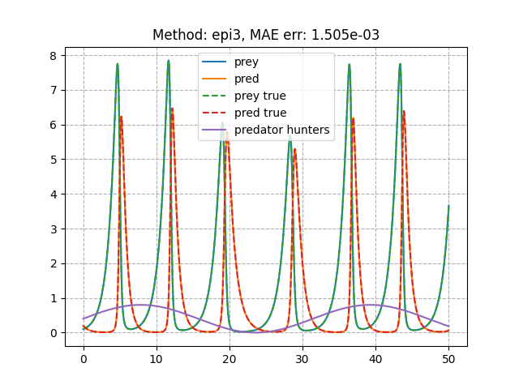
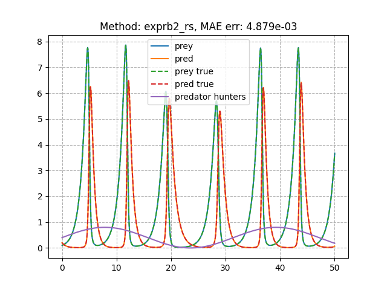

Examples
==========

Example use of the ORMATEX package.

Example 1: Forced Lotka-Volterra
--------------------------------

This example demonstrates defining a non-autonomous ODE system and integrating the system with an exponential integration routine in ORMATEX.  The system is given by:

.. math::

   \frac{dx}{dt} = \alpha x - \beta x y

   \frac{dy}{dt} = \delta x y - \gamma y - h_y(t)

   h_y(t) = 0.4 (\mathrm{sin}(0.2 t) + 1)

   \alpha = \beta = \delta = \gamma = 1

The result is compared against a `dopri5` integration routine provided by Diffrax.

.. literalinclude:: ../../examples/ex_ormatex_rspy.py
   :language: python

After installing the ORMATEX package and executing the following from the examples directory:

.. code::

   python ex_ormatex_rspy.py -method epi3

Gives the following result:

If the the python bindings to the Rust-based integrators were installed (see the install guide), additional integrator methods are available.  Executing the following runs a Rust based implementation of an exponential Rosenbrock method:

.. code::

   python ex_ormatex_rspy.py -method exprb2_rs

Which gives the result:

